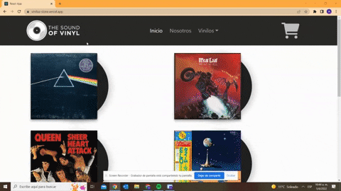

## Vinilus - Store

- E-commerce for selling Vinyls Records.

## Installing

- Fork and clone the project
- Run npm install
- Run npm start , that will start the app on localhost:3000
## Deploy https://TianSeb.github.io/vinilus-store

- Configured Pipeline to build in GH Pages on every deploy (npm run deploy)
- If you want to set your own Pipeline:
- Change "homepage" field in package.json, you may also have to set the configurations on your own repository.

## Dependencies

- react-bootstrap for styling
- react-router-dom for navigation

## App 

- Database is hosted in Firebase.
- Helper functions manage Database conection.

## GIF Funcionalidad

